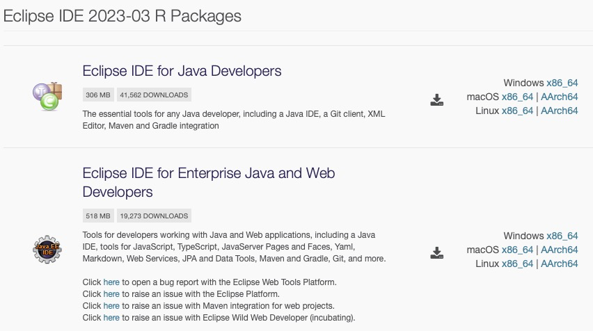
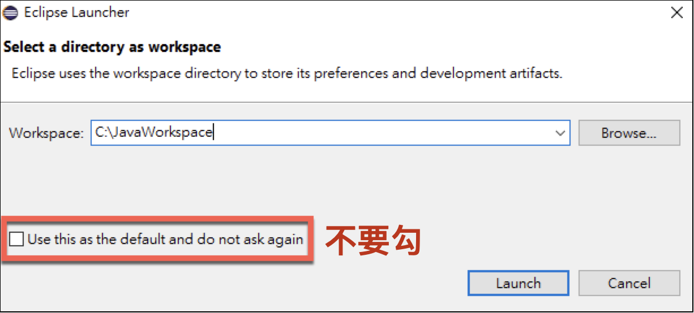
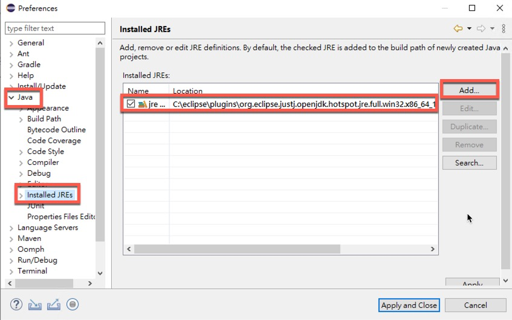
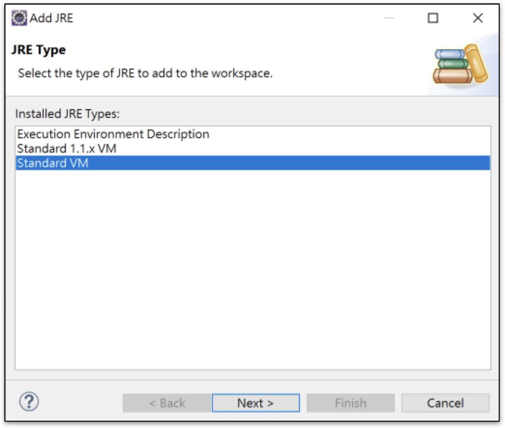
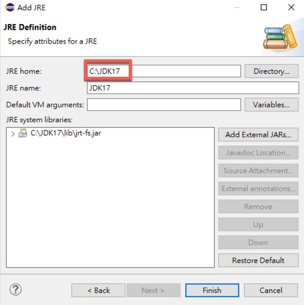
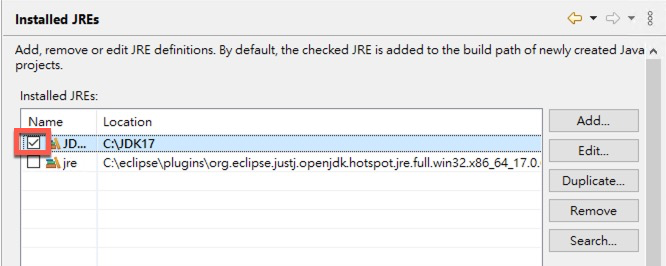
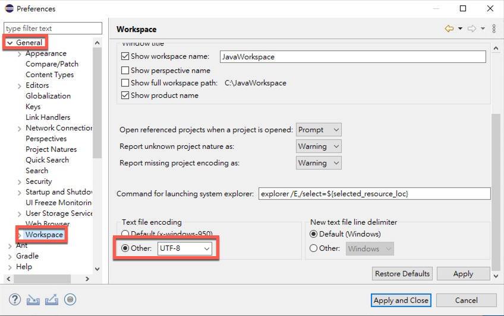
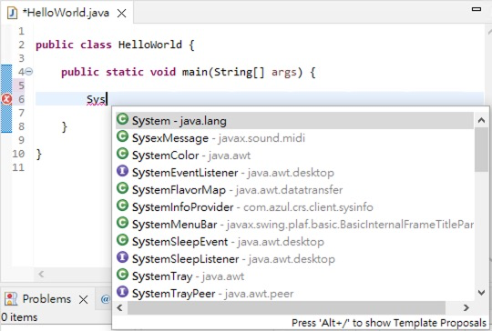
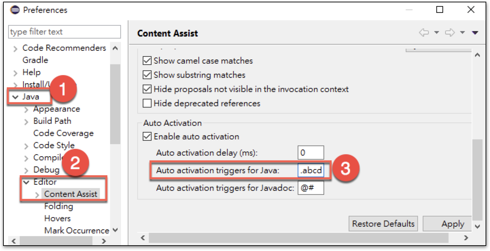

Java開發工具主要有以下二個

1. Intellj 的 IDEA
2. Eclipse

在工具的選擇上，我自己是使用IDEA，不過教學上因為IDEA的community版本在支援JavaEE網頁開發時比較受限，所以這裏說明還是以eclipse為優先。

## Eclipse

下載位置 [Eclipse Download Packages](https://www.eclipse.org/downloads/packages/)

這裏主要有兩個選擇

1. Eclipse IDE for Java Developer，主要開發一般Java應用程式為主。
2. Eclipse IDE For Enterprise Java and Web Developers，包含了Java EE的相關設定，主要用來開發企業級網站。

這裏可以下載第一個Eclipse IDE for Java Developer就可以，執行解壓縮完的目錄中有一個eclipse.exe的執行檔可以啟動eclipse，eclipse本身也是java寫出來的，所以目前新版本的eclipse會自帶一個JDK17用來啟動自己。

### Workspace

啟動eclipse，後會看到以下視窗

這裏的勾勾不要勾，方便切換至不同專案時用的workspace。

### Eclipse常用設定

#### 新增其它版本JDK

Eclipse會自帶一個JDK如下圖所示，你可以按「Add」加入不同版本的JDK來使用。

按下新增「Add」，選擇Standard VM

JRE Home選擇其它版本JDK的位置，再按下「Finish」

這時候就會有多一個JDK版本在清單上，勾勾表示產生專案時預設使用的JDK版本，當然都可以再切換。

#### 設定檔案編碼

新版的eclipse已經改為預設是UTF8。這裏的編碼除了為新增java檔案時的編碼，也是eclipse中java執行環境中的預設編碼。早期eclipse版本預設值是上方的x-windows-950。現在預設是UTF8。

#### 常用的快速鍵

這裏帶幾個實用的快速鍵

- <kbd>alt</kbd>+/ 可以強制叫出輔助視窗，例如你key: Sys然後你就按<kbd>alt</kbd>+/ ，就可以看到一個小視窗跳在游標旁邊。

- <kbd>ctrl</kbd>+/ 註解該行程式。
- <kbd>alt</kbd>+ 上或下，可以上下移動游標所在的那行程式。
- <kbd>ctrl</kbd>+ <kbd>alt</kbd>+上或下，可以複製移動游標所在的那行程式。
- 左邊樹狀檔名上按<kbd>F2</kbd>可以修改Java檔的名稱。

#### Auto Completion

透過<kbd>alt</kbd>+/ 來叫出輔助視窗，另外在key到 . 的時候也會自動跳出來，我們可以延伸這個 . 的設定

編好設定中 / Java / Editor / Content Assist下方有一個Auto activation trigger for java，裏面原本有只一個 .

可以改他改成`.abcdefghijklmnopqrstuvwxyzABCDEFGHIJKLMNOPQRSTUVWXYZ_`

這樣子你在key任何字時就隨時能得到這個小視窗幫助，在開發上很方便。

