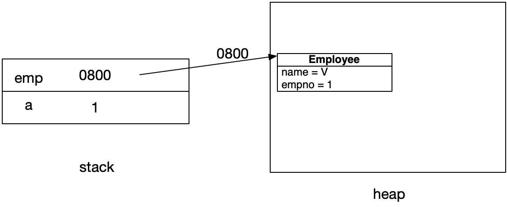
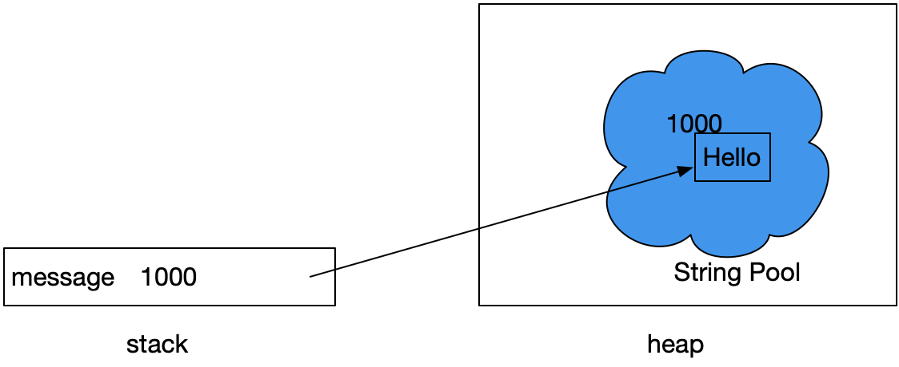
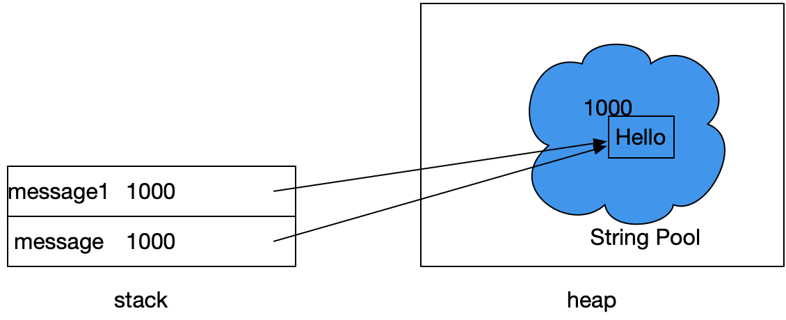
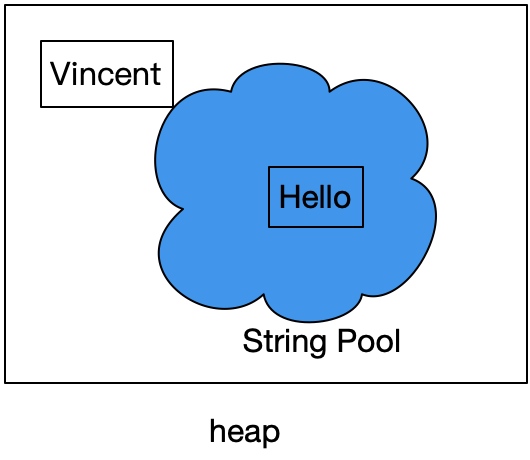
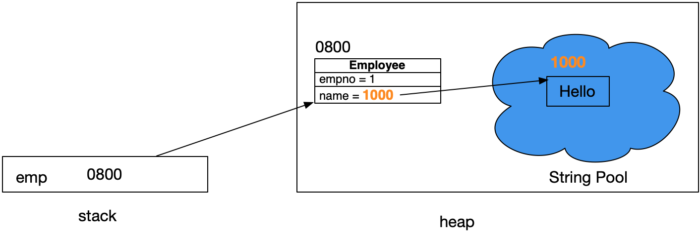

Java記憶體運作，我們分成幾個部分來說明


## 記憶體區塊

記憶體區塊大致分成

1. Stack區，為程式執行方法時，存放區域變數的記憶體區塊。
2. Heap區，主要用來存放物件。

當然還有一些其它的，像是Metaspace，用來存放class相關的資訊。


## 基本型態跟物件型態變數

有一個簡單的規則，區域變數會放在stack區，物件產生後會放在Heap區。什麼是區域變數呢，簡單來說是方法內宣告的變數。例如下方的a、emp變數。

```java
Employee.java
public class Employee{ 
    int empno;　　　　
    char name;
}

TestEmployee.java
public static void main(String[] args){
    int a = 1;
    Employee emp = new Employee();
    emp.empno = 1;
    emp.name = 'V';  
}
```

記憶體使用如下



從這裏可以看到

1. int a = 1，a為區域變數，存放在stack區中，大小為4 byte，存放的值為數值1。
2. new Employee()後，會在Heap產生物件，產生時會有相對應的記憶體位址**開端**，可以想像成是門牌號碼，利用這個位址可以找到該物件，以這個例子來說假設是在0800的位址。
3. emp變數，也是區域變數，裏面存放的其實是在Heap區中Employee物件的**記憶體位置**，官方稱這種叫**reference**。emp變數跟之前的a變數最大的不同在於emp變數是物件(類別)的型態，而變數a是一個基本型態。只要是變數是物件型態就會是該物件的記憶體位址。
4. 基本型態的變數是將值直接存在在變數內(a=1)，而物件型式的變數(emp)則存放的是「**那裏**」可以找到該物件，這個「**那裏**」就是物件在Heap區的記憶體位址。


## String

String完整類別名稱是java.lang.String，是Java中用來處理文字的，相較char只能存單一個字，String可以儲放多個字。文字產生時可以有兩種寫法，先介紹最常用的雙引號產生文字語法。

```java
String message = "Hello"; 
```

第一種最常用的方式是使用雙引號，這種型式是利用Java 內部的String Pool來幫你產生這個String的物件。記憶體運作像這樣子




1. String Pool會先檢查Pool內是否有指定的Hello文字物件，如果沒有，則會產生一個。以這個例子我們假設產生的位址在1000。
2. String Pool也是在heap區，然而Java 6以前並不在Heap區，7之後才改到Heap區。
3. message變數是String型態，存放的就會是該文字的記憶體位址，也就是1000

```java
String message = "Hello"; 
String message1 = "Hello"; 
System.out.println(message == message1);//true
```

如果程式中再使用了一次Hello



1. 第二次使用"Hello"時，pool內已經有Hello的文字了，就不會再產生第二個。
2. message1，此時拿到的位址也會是1000
3. System.out.println(message == message1); 結果會是true，因為兩個變數中的值都是1000。


String也可以使用new的方式來產生文字，這時候的"Vincent"就不受pool管理了，因為是用new的方式，會跟我們一般new物件一樣被放在heap區，如下圖。

```java
String name = new String("Vincent");
```




我們再回到前面的Employee，把name的屬性改成用String

```java
Employee.java
public class Employee{ 
    int empno;　　　　
    String name;
}

TestEmployee.java
public static void main(String[] args){
    Employee emp = new Employee();
    emp.empno = 1;
    emp.name = "Hello";  
}
```




1. emp中放的是Employee物件在heap區的位址。
2. Employee的name是一個String類別型態的屬性，屬性也會是存放該物件(String)的記憶體位址，也就是pool內的1000。
3. 從這裏可以知道，Java當中只要你是使用類別型態的變數，不論是一般**區域變數**或者**屬性**，存放的都是去「**那裏**」找到該物件，也就是物件的記憶體位址。


