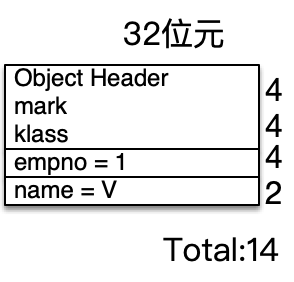
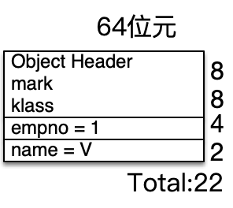

# Java Object Size

接下來我們來看一下物件在Heap區中佔的大小。

物件在Heap區中所佔用的大小，其實是他的屬性大小加總再加上**object header**。以Employee來說，有二個屬性，總共加起來是 6 bytes。

```java
public class Employee{ 
    int empno;  //佔 4 bytes　　　　
    char name;  //佔 2 bytes
}
```

那Object header呢，Object header包含了2個部分

1. mark word，是 **uintptr_t** ，java中沒有這種型態，來自C語言，這種型態是unsigned integer，在32位元系統佔了4 bytes，64位元佔了8 bytes (Java中的int為了簡化使用並沒有在不同位元作業系統下採用不同大小，一律都是4bytes)。mark中會記錄該物件的hash code值、lock、gc info等等資料。
2. klass pointer，則記錄了該物件的class資訊，其實就是**class物件**的記憶體位址(class pointer)，JDK7之前是class物件在Perm Gen space，JDK 8後在Metaspace。預設32位元系統佔了4 bytes，64位元佔了8 bytes。

以32位元為例子：header中mark+klass佔了8 bytes(4+4)，屬性佔了6 bytes，共14 bytes，但記憶體中區塊使用至少要是**8的倍數**，這特性叫**Object Alignment**(可以透過*-XX:ObjectAlignmentInBytes*調整，範圍8-256，預設值是8)，所以必須取到**16bytes**，等於有 16 - 14 = 2 bytes是浪費掉，稱為padding。



再看64位元例子，加總起來要能被8整除，所以會是**24 bytes**，也一樣會有2 bytes 浪費(8(mark)+8(klass)+4(empno)+2(name)=22)，由這裏可以看出理論上64位元的作業系統上使用物件，即便裏面儲存的資料都相同，還是會佔用比較多的記憶體。



## Reference

Reference是用來儲存記憶體的位址(例如emp變數)，也有另一個名詞叫做oops(***Ordinary Object Pointers***的縮寫)，事實上就是C語言的指標。在32位元系統佔了4 bytes，64位元佔了8 bytes。在32位元上，一個reference只能用4 bytes來存放一個記憶體的位址(例如emp裏面的800)，最多就只能記錄到$2^{32}$＝4G左右的大小(4 bytes = 32 bits)，再加上作業系統本身也會用掉記憶體，實際上能留給Heap的就會更少。64位元作業系統可以輕鬆突破這個限制，但每一個reference需要**8** bytes，有些情況下會浪費掉比較多的記憶體，所以有了一個聰明的機制叫**Compressed oops**，在64位元上使用**4 bytes**的reference，達到可以使用較大的Heap卻不會浪費過多的記憶體在reference上。

## Compressed oops

這個機制從Java 6開始，多了一個VM參數叫 -XX:+UseCompressedOops，**在64位元上啟用4 bytes做Reference**，而**Java 7**後只要你的heap size小於**32G**預設就會啟用，要關閉必須額外下指令( *-XX:**-**UseCompressedOops*，注意UseCompressedOops前方的減號就是關閉，＋就是開啟)。

物件建立時消耗的記憶體一定是8的倍數(object alignment)，所以4 bytes(32 bit)記錄記憶體位址的變數(如emp)，最後的3 bit一定是0，簡單用數字8、16、24當例子示範，以bit型式展開：

  8 = 0000 0000 0000 0000 0000 0000 0000 1**000**
16 = 0000 0000 0000 0000 0000 0000 0001 0**000**
24 = 0000 0000 0000 0000 0000 0000 0001 1**000**

可以看到最後3bit都是0，所以32bit記錄時像上面這樣，其實只有前29bit會有值，最後3 bit都是0。

即然最後的３個bit都是0，乾脆把這3個bit拿來用，可以記下更大的範圍。所以JVM在使用Compressed Oops時，會把最後的3bit拿來記錄而不放0，等於可記載的bit變成35，最後3個bit是0而隱藏不記錄(就是把真正的位址除上8)，那要找物件需要真正的記憶位址時，只要利用 << 3就可以還原了(把記錄的位址乘上8)。

| 前32bit | ~~0~~ | ~~0~~ | ~~0~~ |
| ------- | ----- | ----- | ----- |

一旦變成35bit，能使用的size會在 $2^{32+3}$ =$2^{35}$約 32G左右。

例如我要存的Employee的位址是8000，展開bit變成

0000 0000 0000 0000 0001 1111 0100 0**000**

尾巴的3個bit是０，把他移除會變成如下，這個數值是1000，你可以利用 8000 >> 3也可以得到1000。

0000 0000 0000 0000 0001 1111 0100 0~~**000**~~

所以實際上儲存在emp變數中的是1000，而不是8000，如果用到了emp.name的時候，程式中會將1000拿出來，往左移３個bit就會還原真正的記憶體位址了((1000 << 3 = 8000)。

object alignment 是8 bytes時，最後面3 bit是0，如果object alignment 設成16，則變成後面4 bit是0，理論上就可以用到 $2^{32+4}$　這麼多的記憶體，但是object alignment越大，表示浪費掉的空間會越多，因為物件的記憶體大小就必須是16的倍數，所以並不是設越大越好。


> Vincent: JDK7後，只要你指定的max heap size不超過32G，compressed oops會自動啟動。超過32G(含)則會自動關閉。

```shell
例如我執行以下指令，設成31g，以下指令使用jdk17(Zulu jdk 17.0.2)
java -Xmx31g -Xlog:gc+heap+coops=debug HelloWorld
```

[gc,heap,coops] Heap address: 0x0000000280800000, size: 31744 MB, **Compressed Oops mode: Non-zero based**: 0x0000000280000000, **Oop shift amount: 3**

可以看到Compressed Oops mode是啟動的，**如果改成32G，則不會看到Compressed Oops的訊息**。

[OpenJDK](https://wiki.openjdk.org/display/HotSpot/CompressedOops)有提到一旦啟用了Compressed Oops則以下部分會使用4 bytes，包含

1. Object header中的 klass部分。
2. 物件中的屬性型態如果是物件，該屬性也會使用 4 bytes。
3. 物件型式陣列中記錄的物件位址。

整理如下

|           | 32位元 | 64位元 | -XX:+UseCompressedOops |
| --------- | ------ | ------ | ---------------------- |
| Reference | 4      | 8      | 4                      |
| 物件      |        |        |                        |
| mark      | 4      | 8      | 8                      |
| klass     | 4      | 8      | 4                      |

## jol

可以透過jol library驗証，如果你使用maven可以設定dependency，或者直接下載[jol-core-0.17.jar](https://repo1.maven.org/maven2/org/openjdk/jol/jol-core/0.17/jol-core-0.17.jar)。

```xml
<dependency>
    <groupId>org.openjdk.jol</groupId>
    <artifactId>jol-core</artifactId>
    <version>0.17</version>
</dependency>
```

我們先來驗証Reference在不同情況下佔用的記憶體。

```java
import org.openjdk.jol.vm.VM;
public class TestMemory{
    public static void main(String[] args) {
        System.out.println(VM.current().details());
    }
}

結果如下：
# VM mode: 64 bits
# Compressed references (oops): 3-bit shift
# Compressed class pointers: 3-bit shift
# WARNING | Compressed references base/shifts are guessed by the experiment!
# WARNING | Therefore, computed addresses are just guesses, and ARE NOT RELIABLE.
# WARNING | Make sure to attach Serviceability Agent to get the reliable addresses.
# Object alignment: 8 bytes
#                       ref, bool, byte, char, shrt,  int,  flt,  lng,  dbl
# Field sizes:            4,    1,    1,    2,    2,    4,    4,    8,    8
# Array element sizes:    4,    1,    1,    2,    2,    4,    4,    8,    8
```

1. 有Compressed表示CompressedOops是啟用的。3 -bit shift就是前面提的，最後面3個bit都是0被shift掉，因為object alignment是8 bytes。
2. Object alignment：這裏預設是8，也就是物件佔的大小至少要是8的倍數。
3. 下方的表中Field Sizes中的ref欄位為4，ref就是Reference表示佔用4 bytes。

測試關閉CompressedOops，那執行時要加上-XX:**-**UseCompressedOops 參數

如 java -XX:**-**UseCompressedOops  -cp jol-core-0.17.jar:. xxxx

```java
# VM mode: 64 bits
# Compressed references (oops): disabled
# Compressed class pointers: disabled
# Object alignment: 8 bytes
#                       ref, bool, byte, char, shrt,  int,  flt,  lng,  dbl
# Field sizes:            8,    1,    1,    2,    2,    4,    4,    8,    8
# Array element sizes:    8,    1,    1,    2,    2,    4,    4,    8,    8

```

1. Compressed是disabled
2. ref欄位變成8了，就是64位元的預設值。


再來看看物件所使用的記憶體大小，測試CompressedOops預設啟用情況。這裏的Employee中的name改成String，方便測試reference型式。

```java
public class Employee{     
  int empno;  
  String name;
}
```

```java
import org.openjdk.jol.info.ClassLayout;
public static void main(String[] args) {
    System.out.println(ClassLayout.parseClass(Employee.class).toPrintable());
}

Employee object internals:
OFF  SZ               TYPE DESCRIPTION               VALUE
  0   8                    (object header: mark)     N/A
  8   4                    (object header: class)    N/A
 12   4                int Employee.empno            N/A
 16   4   java.lang.String Employee.name             N/A
 20   4                    (object alignment gap)    
Instance size: 24 bytes
Space losses: 0 bytes internal + 4 bytes external = 4 bytes total
```

1. mark這裏SZ欄位 8 bytes，SZ欄位就是Size的意思，OFF是Offset的意思就是bytes偏移量，就是該區段的起始位置，一開始是0。
2. klass(就是(object header: class)這行)，佔了4 bytes。
3. empno，佔了4bytes(因為是int)
4. name佔了4 bytes(因為是物件，所以是reference)，外加padding 4 bytes以滿足8整除，總共24bytes。


將CompressedOops關閉，-XX:**-**UseCompressedOops

```java
import org.openjdk.jol.info.ClassLayout;
public static void main(String[] args) {
    System.out.println(ClassLayout.parseClass(Employee.class).toPrintable());
}
Employee object internals:
OFF  SZ               TYPE DESCRIPTION               VALUE
  0   8                    (object header: mark)     N/A
  8   8                    (object header: class)    N/A
 16   4                int Employee.empno            N/A
 20   4                    (alignment/padding gap)   
 24   8   java.lang.String Employee.name             N/A
Instance size: 32 bytes
Space losses: 4 bytes internal + 0 bytes external = 4 bytes total
```

1. mark還是8 bytes。
2. klass變成8 bytes，相較預設啟用情況多了4 bytes。
3. empno，佔了4bytes(因為是int)
4. name佔了8 bytes，因為Compressed Oops關閉，會使用64位元的預設值 8 bytes。
5. 最後需要32bytes。

使用Compressed oops看起來很不錯，節省了記憶體，最大使用的heap size又可以放大到[32G](https://www.baeldung.com/jvm-compressed-oops#2beyond-32-gb)左右


## 參考文章

1. [Memory Layout of Objects in Java](https://www.baeldung.com/java-memory-layout)
1. [Compressed OOPs in the JVM](https://www.baeldung.com/jvm-compressed-oops#2beyond-32-gb)
1. [Java HotSpot™ Virtual Machine Performance Enhancements](https://docs.oracle.com/javase/7/docs/technotes/guides/vm/performance-enhancements-7.html)
1. [Compressed Reference By Aleksey Shipilëv](https://shipilev.net/jvm/anatomy-quarks/23-compressed-references/) (實際上Compressed oops還有三種模式，32-bit、Zero-Based、non-Zero Based，有興趣的可以參考)