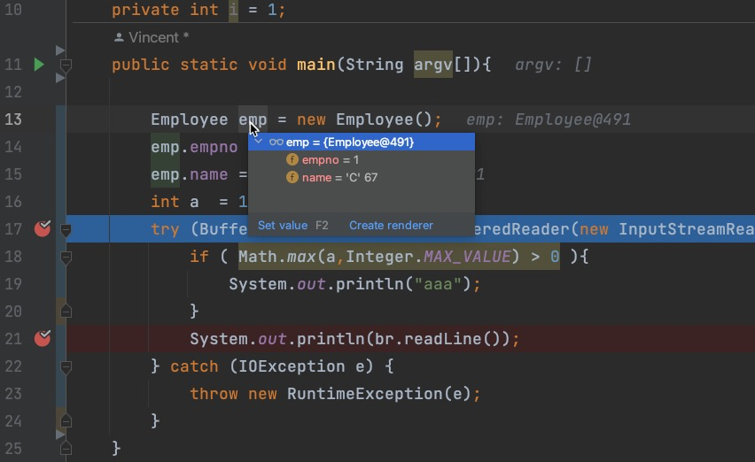

short cut

## debug

### breakpoint

<kbd>command</kbd>+<kbd>F8</kbd>

### Run to cursor

<kbd>alt</kbd>+<kbd>F9</kbd>

### code stack 顏色

yellow: non project file

Tests: green

於preference/ file color設定

### Evaluate expression

<kbd>alt</kbd> 按住　+ click程式　會出現底線

或者 選好code後按

<kbd>command</kbd>+<kbd>alt</kbd>+<kbd>F8</kbd>

以上如果是點在物件上，會臨時顯示物件的狀態

其它不在code上面的，可以用expression view, <kbd>alt</kbd>+ <kbd>F8</kbd>

在evaluation windows中甚至也可以用<kbd>command</kbd>+<kbd>alt</kbd>+<kbd>F8</kbd>

### add to watch

在expression列上輸入後，按<kbd>shift</kbd>+<kbd>command</kbd>+<kbd>enter</kbd>