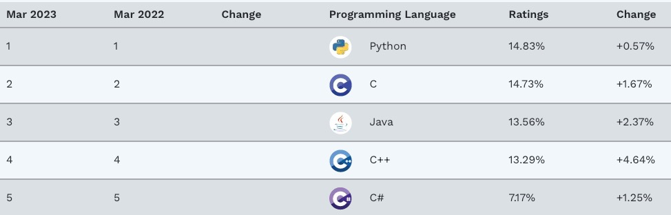

1. Java從2002年開始一直是我工作上使用的語言，至今也20多年了，約在2015年開始有一些機會教Java 程式語言。這裏會分享教授Java課程中的一些有趣的地方。

   2023年[TIOBE](https://www.tiobe.com/tiobe-index/)的程式語言排名如下

   

   

   Java排在第三，第一名是這幾年很火紅的Python。上述的前五個程式語言，大概這10年來，有四個幾乎都一直在榜上前幾名的就是 C 、C++、Java、C#。程式語言要能一直被大量採用，除了本身語法必須與時俱進外，應用場景廣外，**後面最好有一個富爸爸**，所以 Java(Oracle)跟 C#(Microsoft)大概率都能再存活很久的時間。C跟C++更不用說了，更是大概率不會消失(這麼多新的語言都打著要改善C或C++語言的痛處，但這麼多年來沒有一個排名比C++前面) 。

   1. 有人覺得Java難學，語法繁雜，光寫個HelloWorld的程式都比別的語法多，其實在程式編輯工具(IDE)不斷演進下，大部分語法的學習都能很順利且快速的完成，善用工具也是學習語言很重要的一環。
   2. Java難的是後面生態太豐富了，例如你想學寫手機要學會Android，想寫網站，要會Servlet JSP、Spring、Hibernate還有資料庫。的確學到後面是有難度的，要學得深入確實得花上不少功夫，反過來說學了一堆語言，但學的不精，很難有用處。所以不論學那個語言，先想辦法學到夠用再來就要深入學習。
   3. Java最大的強項我覺得是跨平台，跨平台特性做的非常的好。你可以在主流平台上開發(Windows、Mac、Linux)並且在任何平台上執行而不需要重新編譯。
   4. Java就業市場廣大，去104網站搜一下就知道了，.Net C#也是一樣，就業市場職缺多表示參與的人也多，大公司就容易採用這個語言，因為人相對好找，新創公司則可能會採用一些比較冷門的技術選項。
   5. 不過Java不會適用所有的情況，比如你要在一個記憶體有限的裝置內執行Java，像一些物聯網的裝置，那就太困難了，這種應用場景大多會使用C語言。Java也不適合開發遊戲，這類需要即時反應大多不會採用Java當做開發的語言。**每個語言都會有他適合的應用場景**。

   
   
   如果你有任何問題，或者覺得內容有錯，都歡迎連絡我　vincent.tsd
